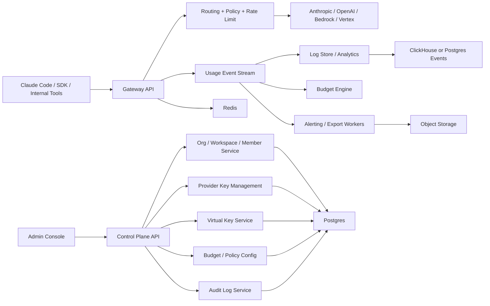
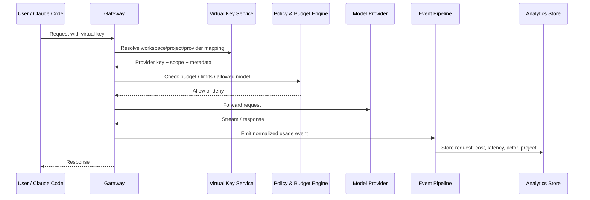

# Modelyard Layer - Overall Architecture

## 1. Product Definition

This product is not a `token reseller`.

It is a `team control plane` for Claude Code and other AI coding tools:

- BYOK: users bring their own Anthropic / OpenAI / Bedrock / Vertex keys
- Centralized routing: route all traffic through one controlled gateway
- Team governance: budgets, permissions, projects, environments, audit logs
- Cost visibility: per-user / per-project / per-customer usage and spend
- Delivery layer: onboarding, export, alerts, support, enterprise deployment

The product solves one core problem:

> Teams do not just need "an API key". They need a safe, observable, auditable, and billable way to run AI coding at scale.

---

## 2. Architecture Goals

### Core goals

- Do not resell upstream access by default
- Support BYOK first
- Make Claude Code team usage controllable
- Separate control plane and data plane
- Make logs queryable and exportable
- Support SMB SaaS first, enterprise deployment second

### Non-goals

- Do not compete as a broad "200-model marketplace" in V1
- Do not build a full AI IDE
- Do not become a generic prompt engineering suite in V1

---

## 3. Product Scope

### V1 scope

- Organization / workspace / member management
- Provider connections
- Encrypted provider key storage
- Virtual keys for teams and projects
- OpenAI-compatible and Anthropic-compatible gateway
- Usage logs
- Budget controls
- CSV / XLSX export
- Project and environment separation
- Basic alerting

### V2 scope

- Claude Code onboarding templates
- Per-user and per-customer chargeback
- Slack / email budget alerts
- Approval workflows for sensitive models
- RBAC refinement
- Better analytics and daily rollups

### V3 scope

- SSO / SCIM
- Self-hosted / air-gapped edition
- Regional data residency
- Policy engine
- Enterprise audit package

---

## 4. System Overview



---

## 5. Control Plane vs Data Plane

### Control plane

This is where admins configure the system.

Modules:

- organizations
- workspaces
- projects
- environments
- members
- roles and permissions
- provider connections
- encrypted provider keys
- virtual keys
- budgets
- policies
- exports
- audit logs

Characteristics:

- low QPS
- configuration-heavy
- business-critical
- relational data

### Data plane

This is where inference traffic flows.

Modules:

- API gateway
- auth and virtual key resolution
- request tagging
- provider routing
- fallback / retry
- streaming pass-through
- rate limiting
- budget enforcement
- event emission

Characteristics:

- high QPS
- latency-sensitive
- failure-sensitive
- stateless where possible

Why split them:

- product changes in control plane should not break inference traffic
- data plane must stay lean and reliable
- enterprise deployment often requires data plane isolation

---

## 6. Core Components

### 6.1 Admin Console

Recommended role:

- workspace admin UI
- provider connection setup
- usage dashboards
- budget and policy config
- export and audit center

Suggested stack:

- Next.js / React
- TypeScript
- Tailwind + component library

### 6.2 Control Plane API

Responsibilities:

- CRUD for org/workspace/project/environment
- manage provider accounts and encrypted keys
- issue virtual keys
- manage budgets and policies
- serve export and analytics metadata

Suggested stack:

- TypeScript
- Fastify or NestJS
- Postgres

### 6.3 Gateway API

Responsibilities:

- receive Claude Code / SDK traffic
- resolve org/project/environment
- map virtual key to provider key
- inject routing metadata
- enforce policy and budget
- proxy request to provider
- emit normalized usage events

Suggested stack:

- V1: TypeScript + Fastify
- V2 scale path: Go gateway if throughput becomes the bottleneck

### 6.4 Key Management Service

Responsibilities:

- encrypt provider keys at rest
- rotate or revoke keys
- never expose raw upstream keys to end users

Suggested security controls:

- envelope encryption
- KMS-backed secrets
- per-workspace key records
- audit logs for access and rotation

### 6.5 Virtual Key Service

Purpose:

- teams should use your virtual key, not the raw upstream key

Virtual keys allow:

- per-member tracking
- per-project attribution
- permission scopes
- easy revocation
- separate budgets

### 6.6 Usage / Billing Engine

Responsibilities:

- normalize provider responses
- compute request cost
- attach cost to org/project/user/customer
- aggregate daily rollups
- trigger budget alerts

### 6.7 Export / Audit Service

Responsibilities:

- export logs to CSV/XLSX
- retain audit trails
- generate finance-friendly reports
- support incident review

---

## 7. Data Model

### Tenant hierarchy

```text
Organization
  -> Workspace
    -> Project
      -> Environment
        -> Virtual Key
        -> Requests / Usage Events
```

### Core tables

- `organizations`
- `workspaces`
- `members`
- `roles`
- `projects`
- `environments`
- `provider_accounts`
- `provider_keys_encrypted`
- `virtual_keys`
- `key_scopes`
- `budgets`
- `budget_rules`
- `usage_events`
- `usage_ledger_entries`
- `usage_rollups_daily`
- `usage_forecast_daily`
- `model_mappings`
- `price_snapshots`
- `alerts`
- `exports`
- `audit_logs`

### Why this model matters

- finance wants cost by project or customer
- engineering wants logs by environment
- admins want revocation by user or team
- support wants request-level traces

---

## 8. Request Lifecycle



---

## 9. Storage Design

### V1

- `Postgres`
  - control plane
  - small to medium usage events
  - exports metadata
- `Redis`
  - rate limiting
  - short-lived caching
  - budget hot counters
- `Object Storage`
  - CSV/XLSX exports
  - optional raw log snapshots

### V2 scale-up

- `ClickHouse`
  - request-level event analytics
  - cost and latency slicing
  - high-cardinality log queries

### Why not start with too much infrastructure

For V1, shipping matters more than perfect infra purity.

Recommended path:

1. Start with Postgres + Redis + Object Storage
2. Add ClickHouse when event volume or reporting latency justifies it

---

## 10. Provider Strategy

### Supported providers in order

#### V1

- Anthropic API
- OpenAI-compatible providers

#### V2

- AWS Bedrock
- Google Vertex AI

### Why this order

- V1 should match the coding-agent use case directly
- Anthropic is the most aligned with Claude Code positioning
- OpenAI-compatible support widens adoption without overbuilding

---

## 11. Security Model

### Minimum required

- encrypted provider keys
- virtual key indirection
- audit log on all key operations
- per-workspace isolation
- role-based access control
- signed export downloads

### Enterprise upgrades

- SSO / SCIM
- IP allowlists
- regional storage
- self-hosted deployment
- customer-managed KMS

---

## 12. Deployment Modes

### SaaS

Best for:

- startups
- agencies
- SMB teams

### Hybrid

Best for:

- customers who want cloud control plane but private routing/data plane

### Self-hosted

Best for:

- enterprises
- regulated environments
- customers with residency requirements

Recommended order:

1. SaaS first
2. Hybrid second
3. Self-hosted third

---

## 13. Recommended Monorepo Layout

```text
/apps
  /web-admin
  /control-api
  /gateway
  /worker

/packages
  /shared-types
  /provider-adapters
  /policy-engine
  /billing-core
  /ui

/infra
  /docker
  /terraform
  /k8s

/docs
  /product
  /api
  /security
```

---

## 14. MVP Build Order

### Phase 1

- organization / workspace / project
- provider connection
- encrypted key storage
- virtual key issuance
- basic gateway proxy

### Phase 2

- usage logs
- project attribution
- budget limits
- daily spend rollups
- CSV/XLSX export

### Phase 3

- member roles
- environment separation
- alerting
- audit logs
- Claude Code onboarding flow

### Phase 4

- enterprise package
- SSO / SCIM
- self-hosted
- regional data options

---

## 15. Product Positioning Implications

This architecture only works if the product is sold as:

- team governance
- usage visibility
- cost control
- secure routing
- enterprise-ready AI coding operations

This architecture does **not** fit a pure low-price token-reseller business.

Why:

- resellers compete on price and supply
- this system competes on control, visibility, and trust

---

## 16. Final Recommendation

If we build this product, the best path is:

1. Start as a `Claude Code team ops layer`
2. Make `BYOK + logs + budgets + export` the initial wedge
3. Add `permissions + audit + environments`
4. Only later expand into broader AI gateway territory

This gives the project:

- better gross margin
- stronger enterprise story
- lower compliance risk
- clearer differentiation than a generic model gateway
