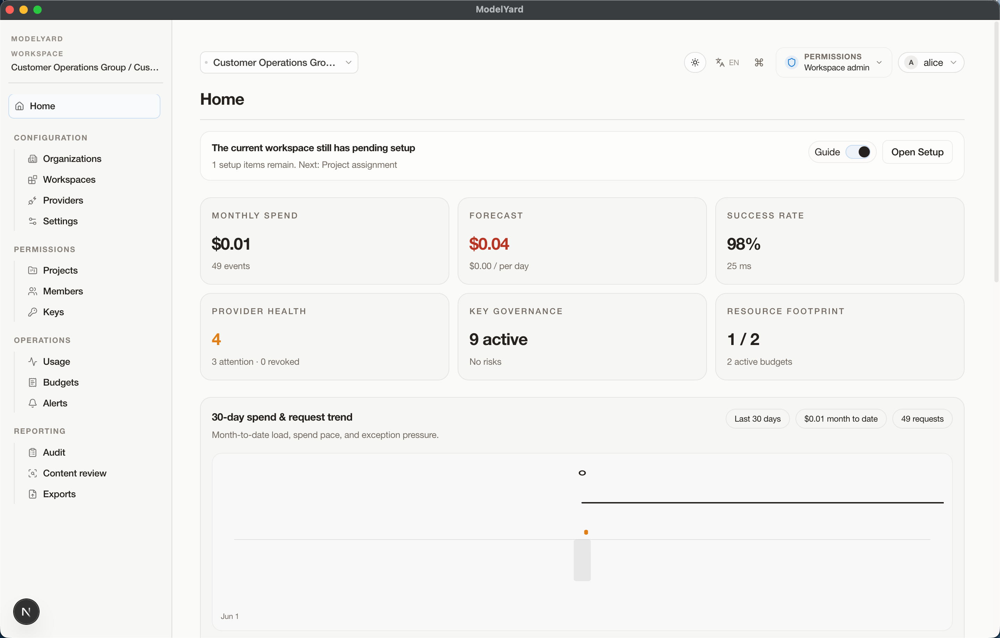
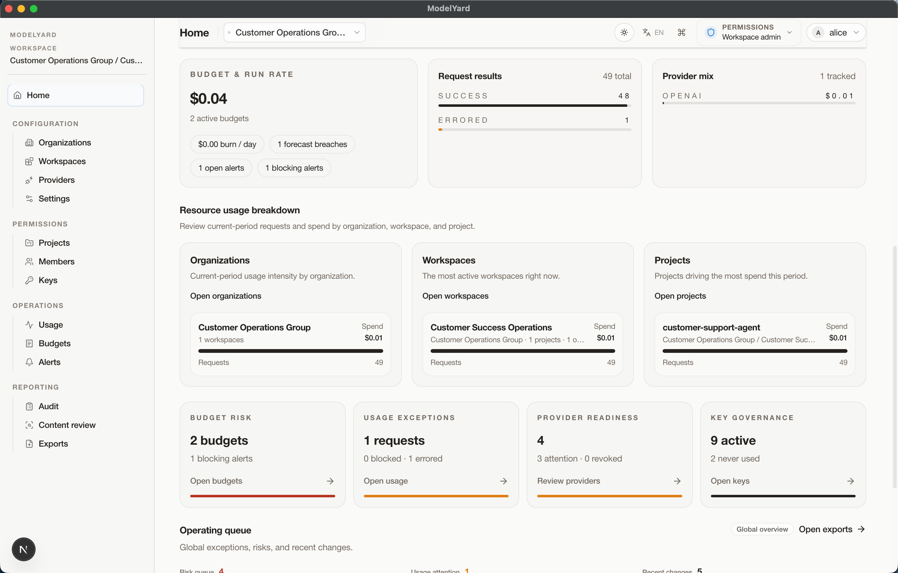
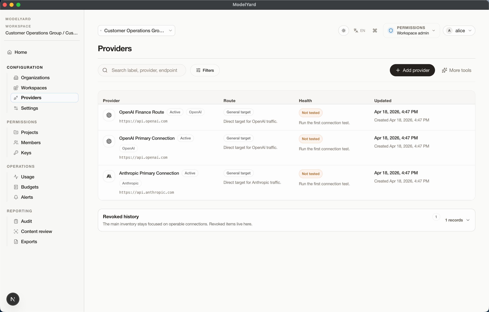
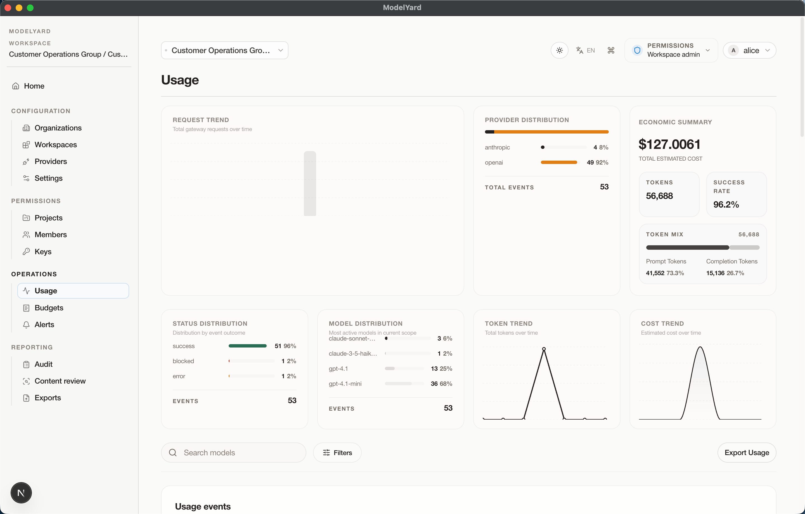
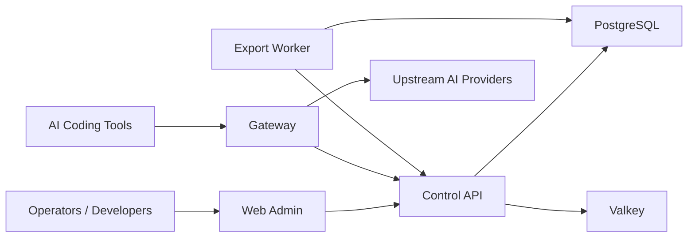

<div align="center">


# ModelYard

**AI Access & Governance Infrastructure for teams running AI coding tools and provider gateways.**

[](./LICENSE)
[](./LICENSE)
[](https://nextjs.org/)
[](https://react.dev/)
[](https://www.typescriptlang.org/)
[](https://www.docker.com/)

`ai-gateway` · `llm-gateway` · `byok` · `virtual-keys` · `ai-governance` · `llmops` · `model-routing` · `api-key-management`

</div>

ModelYard gives engineering, platform, security, and finance teams one governed layer for AI access, routing, budgets, usage records, exports, and auditability.

It is not a token resale platform, a chat app, or a lightweight proxy dashboard. It is a control plane and AI gateway for BYOK provider connections, virtual keys, model routing, usage governance, and operational evidence.

> This repository is source-available. Personal and non-commercial use is allowed. Commercial use requires prior written permission. See [LICENSE](./LICENSE).

## Contents

- [Product Preview](#product-preview)
- [Why ModelYard](#why-modelyard)
- [Features](#features)
- [Architecture](#architecture)
- [Repository Layout](#repository-layout)
- [Quick Start](#quick-start)
- [Docker Demo](#docker-demo)
- [Commands](#commands)
- [Documentation](#documentation)
- [Search Keywords](#search-keywords)
- [License](#license)

## Product Preview

### Home





### Models



### Usage Guide



## Why ModelYard

Teams do not just need another API key. They need a safe and observable way to let people, projects, coding agents, and internal tools use AI providers without spreading raw upstream credentials everywhere.

ModelYard provides:

| Need | ModelYard capability |
| --- | --- |
| Provider access | BYOK provider connections and OpenAI-compatible routing |
| Credential isolation | Virtual keys scoped to workspaces, projects, and environments |
| Cost control | Budgets, usage records, token accounting, and exportable reports |
| Operations | Routing health, provider posture, recovery states, and audit logs |
| Governance | Permission boundaries, usage controls, exports, and evidence trails |
| Deployment | Local dev, Docker demo, preview stack, and self-host evaluation paths |

Common search terms for this category include AI gateway, LLM gateway, API key management, BYOK routing, virtual key management, AI governance, model routing, LLMOps, usage metering, audit logs, and self-hosted AI infrastructure.

## Features

| Area | Included |
| --- | --- |
| Control plane | Organizations, workspaces, projects, members, providers, budgets, alerts |
| Gateway | Virtual-key auth, provider selection, request normalization, response headers |
| Provider model | BYOK connections, provider metadata, routing defaults, model catalog health |
| Usage | Usage events, usage ledger, cost records, blocked events, exports |
| Audit | Audit logs, export evidence, operational history |
| Admin console | Resource-oriented Next.js operations UI |
| Background jobs | Export worker for CSV/XLSX/report generation |
| Tooling | Smoke checks, demo seed/reset, env validation, Docker compose stacks |

## Architecture



## Repository Layout

```text
apps/
  web-admin       Next.js operations console
  control-api     Control plane API
  gateway         Virtual-key gateway and provider router
  export-worker   Background export processor
  desktop         Local desktop shell

packages/
  contracts       Shared schemas and API contracts
  config          Environment parsing and validation
  database        Migrations, repositories, seed/reset utilities
  export-jobs     Export generation and worker runtime

infra/            Dockerfiles and compose stacks
docs/             Architecture, API, deployment, security, and product notes
tools/            Local development, smoke, preview, and production utilities
```

## Quick Start

### Prerequisites

- Node.js 20+
- npm
- Docker with Compose

### Install

```bash
npm install
```

### Configure

```bash
cp .env.development.example .env.development
npm run env:check
```

### Start Dependencies

```bash
npm run db:up
```

### Migrate And Seed

```bash
npm run db:migrate
npm run demo:seed
```

### Run The Stack

```bash
npm run dev:stack
```

Open:

| Surface | URL |
| --- | --- |
| Web admin | `http://127.0.0.1:3001` |
| Control API health | `http://127.0.0.1:4001/healthz` |
| Gateway health | `http://127.0.0.1:4002/healthz` |

Seed and start in one command:

```bash
npm run dev:stack:seed
```

## Docker Demo

```bash
npm run demo:up
```

This starts Postgres, Valkey, the web admin, the control API, the export worker, and the gateway.

```bash
npm run demo:down
```

## Commands

| Command | Purpose |
| --- | --- |
| `npm run lint` | Repository checks |
| `npm run typecheck` | TypeScript validation |
| `npm test` | Test suites |
| `npm run build` | Full monorepo build |
| `npm run demo:smoke` | Demo stack smoke checks |
| `npm run smoke:web-admin` | Web admin smoke checks |
| `npm run dev:web-admin` | Run only the admin console |
| `npm run dev:control-api` | Run only the control API |
| `npm run dev:gateway` | Run only the gateway |

## Documentation

| Document | Description |
| --- | --- |
| [Architecture](./ARCHITECTURE.md) | System structure and service boundaries |
| [Development Setup](./docs/DEVELOPMENT.md) | Local setup and developer workflow |
| [API Reference](./docs/API_REFERENCE.md) | Control API and gateway API notes |
| [Deployment Guide](./docs/DEPLOYMENT.md) | Runtime and deployment guidance |
| [Environment Matrix](./docs/ENV_MATRIX.md) | Environment variable reference |
| [Auth Strategy](./docs/AUTH_STRATEGY.md) | Authentication and identity model |
| [Security Boundary](./docs/SECURITY_BOUNDARY.md) | Security assumptions and boundaries |
| [Positioning One-Pager](./docs/POSITIONING_ONE_PAGER.md) | Product positioning and language |
| [OSS Components](./docs/OSS_COMPONENTS.md) | Third-party component and license policy |

## Search Keywords

Modelyard is relevant to teams searching for:

| Keyword | How it maps to Modelyard |
| --- | --- |
| AI gateway | Governed gateway in front of AI providers and coding tools |
| LLM gateway | OpenAI-compatible access layer for model requests |
| BYOK | Bring-your-own-key provider connections and credential isolation |
| Virtual keys | Workspace, project, and environment scoped access keys |
| AI governance | Budgets, permissions, usage controls, audit logs, and exports |
| LLMOps | Operational workflows for model access, routing, observability, and cost tracking |
| Model routing | Provider selection, routing defaults, and model catalog health |
| API key management | Centralized key issuance, rotation, isolation, and revocation workflows |
| AI cost management | Token usage, spend tracking, budget policies, and exportable reports |
| Self-hosted AI infrastructure | Local, Docker, preview, and self-host evaluation paths |

Suggested GitHub topics:

```text
ai-gateway
llm-gateway
llmops
ai-governance
byok
virtual-keys
model-routing
api-key-management
ai-cost-management
openai-compatible
self-hosted
typescript
nextjs
fastify
postgresql
docker
```

## Security

- Do not commit real provider keys, admin tokens, database passwords, or production environment files.
- Use `.env.*.example` files as templates only.
- Rotate demo credentials before any real pilot, preview, or customer-facing deployment.
- Review [Security Boundary](./docs/SECURITY_BOUNDARY.md) before exposing services outside localhost.

## License

Modelyard is released under the [Modelyard Personal Use License](./LICENSE).

Personal, educational, research, evaluation, and other non-commercial use is allowed. Commercial use requires prior written permission from the copyright holder.

This is a source-available license, not an OSI-approved open-source license.
