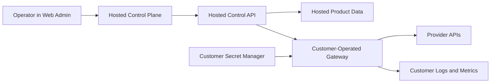

# Hybrid Architecture and Operations

Hybrid means the control plane stays vendor-hosted while the customer runs the gateway or routing layer inside their own environment.

## Reference Shape

## Responsibility Split

| Area | We own | Customer owns |
| --- | --- | --- |
| Control plane | web admin, policy workflows, reporting model, product releases | network access to the hosted control plane |
| Data plane | integration shape and gateway contract | gateway runtime, outbound provider path, runtime patching |
| Secrets | product-side secret handling for hosted components | provider credentials, gateway secret injection, rotation workflow |
| Operations | hosted control plane uptime and product fixes | gateway health, local monitoring, incident response inside customer infra |

## When To Position Hybrid

- customer requires traffic egress from their own network
- customer wants provider credentials to stay in their environment
- customer still accepts a vendor-hosted operator control plane
- customer can operate a small container or VM footprint

## Baseline Topology

- one hosted control plane account
- one customer-managed gateway deployment
- customer-managed secret store for provider credentials
- customer-managed telemetry sink for gateway logs and health

## Operator Workflow

1. Configure workspace policy and routing intent in the hosted control plane.
2. Deploy or update the customer gateway runtime.
3. Inject provider credentials and route defaults inside the customer environment.
4. Validate gateway health and one end-to-end request path.
5. Review usage, budgets, alerts, and exports from the hosted control plane.

## Operational Guardrails

- keep the gateway deployment stateless outside the shared database and secret inputs
- version the gateway rollout with the same release identifier as the control plane account plan
- agree in advance whether gateway incidents are customer-executed or joint-response during pilot hours
- never promise that Hybrid removes all support coordination; it moves the runtime boundary, not the need for joint change control

## Runbook Links

- [Observability Baseline](./OBSERVABILITY_BASELINE.md)
- [Environment Matrix](./ENV_MATRIX.md)
- [Upgrade and Rollback Runbook](./UPGRADE_ROLLBACK_RUNBOOK.md)
